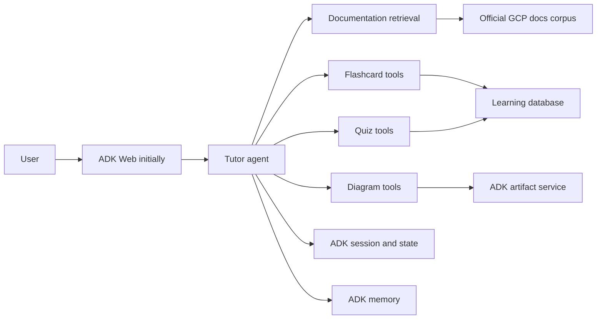

# GCP Learning Studio — Agent Handover

Last updated: 21 August 2026

## Handover purpose

This document is the starting context for a new coding agent. Build the project
incrementally with the user, explaining important design decisions and avoiding
large speculative scaffolds.

## User context

Ben is an experienced Data Scientist and Analytics Engineer with strong Python,
SQL, BigQuery, dbt, pandas, LookML, and credit-risk experience. He is using
these projects to learn software engineering and agent-system architecture,
including APIs, persistence, authentication, background jobs, deployment,
MCP, evaluation, and Google ADK.

Optimise for learning:

- Explain boundaries and data flow instead of hiding them behind abstractions.
- Prefer a small working vertical slice before adding infrastructure.
- Use typed contracts and deterministic code for calculations and scheduling.
- Do not introduce multi-agent or workflow complexity without a concrete need.
- Preserve user work and never delete the abandoned chess project unless asked.

## Existing project context

The projects currently live directly under `~/code`:

```text
~/code/
├── GOOGLE_ADK_LEARNING_PATH.md
├── adk-1-country-agent/
├── adk-2-matchday-desk/
└── adk-3-chess-study-studio/
```

The chess project is no longer motivating and is being replaced. Create a new
independent project:

```text
~/code/adk-3-gcp-learning-studio
```

Do not repurpose or delete `adk-3-chess-study-studio`; leave it untouched.

Use:

- Python 3.12+
- `uv` for dependency management
- `google-adk>=2,<3`
- pytest and Ruff
- snake_case for the Python package
- kebab-case for the repository directory

## Product vision

Build a personalised learning application grounded in official Google Cloud
documentation. It should help Ben learn products such as:

- Cloud Run
- Cloud Build
- Artifact Registry
- Agent Development Kit
- Agent Platform / Agent Runtime
- Cloud Storage
- Cloud SQL
- Pub/Sub
- Cloud Tasks
- Cloud Scheduler
- IAM and service accounts

The product should combine four experiences:

1. **Ask:** Answer GCP questions using retrieved official documentation and
   show citations.
2. **Learn:** Explain concepts at an appropriate depth and use examples and
   comparisons.
3. **Visualise:** Generate useful architecture, sequence, and data-flow
   diagrams.
4. **Review:** Create flashcards from sources and misconceptions, then schedule
   them using spaced repetition.

Example interactions:

```text
Explain the difference between Cloud Run services and Cloud Run jobs.

Draw the path from a git push through Cloud Build, Artifact Registry and
Cloud Run.

Generate five flashcards about Cloud Run autoscaling from the sources we just
used.

Quiz me on IAM service accounts. Ask one question at a time.

What am I repeatedly getting wrong about Pub/Sub delivery semantics?
```

## Product principles

### Official sources first

Use official Google Cloud and ADK documentation as the initial corpus. Every
factual answer and generated flashcard must preserve source URLs. If the corpus
does not support a claim, the agent should say so.

### RAG is evidence retrieval, not memory

RAG retrieves product documentation. ADK memory holds qualitative learner
context. The flashcard database holds exact scheduling state. Do not blur these
responsibilities.

### The LLM does not own the scheduler

Use a deterministic spaced-repetition algorithm, preferably FSRS through a
maintained Python implementation selected and pinned at implementation time.
The model may generate and grade learning content, but it must not invent due
dates or modify review history directly.

### Build one vertical slice first

Start with Cloud Run only. Do not ingest the entire GCP documentation site.
Expand one product at a time after grounded Q&A and citations are reliable.

### Citations are part of the contract

Answers, flashcards, and diagrams must retain evidence provenance:

```text
source title
source URL
retrieval/index timestamp
relevant excerpt or chunk ID
```

## Architecture direction



The design should allow retrieval backends to change without changing the
tutor's domain interface:

```python
class DocumentationRetriever(Protocol):
    async def search(self, query: str, products: list[str], limit: int) -> list[SourceChunk]: ...
```

Possible implementations:

- `VertexSearchRetriever`
- `VertexRagRetriever`
- a small local retriever for tests

## Retrieval decision

Prefer **Vertex AI Search / Agent Search** for the first hosted retrieval
implementation because ADK provides `VertexAiSearchTool` and its events expose
grounding metadata that can be inspected for citations.

ADK also provides `VertexAiRagRetrieval`, but the current official example
states that this retrieval tool must be the only tool on its agent. If that
option is selected, isolate it in a dedicated retrieval agent and let the tutor
call it rather than mixing it with flashcard and diagram tools.

Do not commit to either managed backend before proving a tiny retrieval spike.
The first technical decision should be an explicit comparison:

| Question | Vertex AI Search | Vertex AI RAG Engine |
|---|---|---|
| Can it ingest the chosen official docs cleanly? | Verify | Verify |
| Does ADK expose usable citations? | Grounding metadata | Verify output metadata |
| Can retrieval coexist with other tools? | Verify | Known sole-tool constraint |
| Setup and running cost | Measure | Measure |
| Local-test strategy | Fake retriever | Fake retriever |

Record the chosen option in an Architecture Decision Record rather than hiding
the decision in code.

Relevant ADK documentation:

- https://adk.dev/integrations/agent-search/
- https://adk.dev/integrations/knowledge-engine/
- https://adk.dev/sessions/
- https://adk.dev/sessions/state/
- https://adk.dev/sessions/memory/
- https://adk.dev/artifacts/
- https://adk.dev/callbacks/
- https://adk.dev/evaluate/

## Responsibility boundaries

| Data | Correct home |
|---|---|
| GCP documentation | Retrieval corpus |
| Exact cards and review schedule | Application database |
| Current lesson and quiz position | ADK session state |
| Explanation and display preferences | `user:` state |
| Recurring misconceptions and prior familiarity | ADK memory |
| Diagram source, SVG/PNG, exported decks | Artifact service |
| Tool calls and model activity | ADK events |

Do not put documentation chunks, full card collections, or FSRS scheduling
records into ADK memory.

## Proposed package structure

Keep the MVP smaller than this and add modules only when needed:

```text
adk-3-gcp-learning-studio/
├── .env.example
├── .gitignore
├── README.md
├── pyproject.toml
├── adk_3_gcp_learning_studio/
│   ├── __init__.py
│   ├── agent.py
│   ├── config.py
│   ├── schemas.py
│   ├── prompts.py
│   ├── retrieval/
│   │   ├── base.py
│   │   ├── fake.py
│   │   └── vertex_search.py
│   ├── flashcards/
│   │   ├── models.py
│   │   ├── repository.py
│   │   └── scheduler.py
│   ├── tools/
│   │   ├── retrieval.py
│   │   ├── flashcards.py
│   │   ├── review.py
│   │   └── diagrams.py
│   ├── callbacks.py
│   └── services.py
├── migrations/
├── evals/
└── tests/
```

Do not create all these empty files during initial scaffolding.

## Core domain models

### Source chunk

```python
class SourceChunk(BaseModel):
    chunk_id: str
    product: str
    title: str
    url: HttpUrl
    text: str
    indexed_at: datetime
    relevance_score: float | None = None
```

### Flashcard draft

```python
class FlashcardDraft(BaseModel):
    concept: str
    question: str
    answer: str
    source_chunk_ids: list[str]
    source_urls: list[HttpUrl]
    difficulty: Literal["introductory", "intermediate", "advanced"]
    card_type: Literal["recall", "comparison", "prediction", "application"]
```

Reject generated cards that have no source reference.

### Review response

```python
class ReviewResponse(BaseModel):
    card_id: UUID
    learner_answer: str
    rating: Literal["again", "hard", "good", "easy"]
    reviewed_at: datetime
```

The application converts this rating into the scheduler's native representation
and persists the resulting schedule deterministically.

### Diagram specification

Prefer a typed specification rather than arbitrary renderer code:

```python
class DiagramSpec(BaseModel):
    title: str
    diagram_type: Literal["architecture", "sequence", "flow", "comparison"]
    nodes: list[DiagramNode]
    edges: list[DiagramEdge]
    source_chunk_ids: list[str]
```

A deterministic renderer should produce Mermaid source and optionally SVG or
PNG. Save both the source and rendered output as artifacts.

## Database outline

Start with SQLite and SQLAlchemy. Move to PostgreSQL only for deployment.

Suggested tables:

### `flashcards`

- `id`
- `concept`
- `question`
- `answer`
- `difficulty`
- `card_type`
- `status`
- `created_at`
- `updated_at`

### `flashcard_sources`

- `flashcard_id`
- `chunk_id`
- `source_url`
- `source_title`

### `reviews`

- `id`
- `flashcard_id`
- `rating`
- `learner_answer`
- `reviewed_at`
- scheduler-specific before/after state

### `card_schedules`

- `flashcard_id`
- `due_at`
- `state`
- `stability`
- `difficulty`
- `last_reviewed_at`

### `study_sessions`

- `id`
- `adk_session_id`
- `mode`
- `product`
- `started_at`
- `completed_at`
- `score`

### `misconceptions`

- `id`
- `concept`
- `summary`
- `evidence_review_id`
- `status`
- `first_seen_at`
- `last_seen_at`

Avoid duplicating ADK's complete event history in the application database.

## Agent and tool design

### MVP agent

Begin with a single grounded documentation agent. It should:

- retrieve before answering factual GCP questions;
- cite the sources used;
- distinguish sourced fact from analogy;
- say when evidence is insufficient;
- avoid generating cards until explicitly asked.

### Initial domain tools

```text
search_gcp_documentation(query, products, limit)
generate_flashcard_drafts(topic, count, difficulty)
save_flashcards(cards)
get_due_flashcards(limit, products)
submit_review(card_id, learner_answer, rating)
```

The `generate_flashcard_drafts` operation must receive retrieved evidence; it
must not create unsupported cards from model memory.

### Later tools

```text
create_diagram(topic, diagram_type)
save_diagram_artifact(spec)
get_learning_summary(product)
record_explanation_preference(preference)
```

## State design

Possible keys:

```python
{
    "user:explanation_depth": "intermediate",
    "user:preferred_diagram_type": "sequence",
    "current_product": "cloud-run",
    "study_mode": "review",
    "active_card_ids": ["..."],
    "current_card_index": 2,
    "session_score": 4,
    "temp:retrieved_chunk_ids": ["..."],
}
```

State changes should travel through ADK-managed state deltas and events. Do not
manually append events to the session.

## Memory design

Useful memories include:

- Ben understands containers but confuses image storage with image execution.
- Ben prefers data-flow diagrams before prose explanations.
- Pub/Sub acknowledgement deadlines remain a recurring weak area.
- Ben is already comfortable with BigQuery concepts.

Use memory to influence teaching and retrieval, not to assert current GCP
product behavior. Current product facts must still come from RAG.

Add memory only after persistent cards and sessions are working. ADK supports
loading memory with `preload_memory` and automatically saving sessions through
an after-agent callback; do not enable indiscriminate memory capture without
reviewing what will be stored.

## Callback design

Introduce callbacks after the core vertical slice.

### Before-model

- Ensure retrieved evidence is available for factual answers.
- Limit unnecessary documentation content sent to the model.

### After-model

- Check that factual answers include citations.
- Reject invented product features or unsupported flashcards.
- Record model latency and usage metadata.

### After-tool

- Record retrieval backend, chunk IDs, source freshness, and result count.
- Record card-generation and review operations without logging sensitive text
  unnecessarily.

Do not place spaced-repetition scheduling logic in callbacks.

## Diagram strategy

Diagrams should teach rather than decorate. Start with:

- request/data-flow diagrams;
- deployment architecture diagrams;
- sequence diagrams;
- comparisons showing responsibility boundaries.

Workflow:

```text
retrieve sources
→ generate typed DiagramSpec
→ validate required concepts
→ render Mermaid
→ save .mmd and .svg/.png artifacts
→ ask one comprehension question
```

## Evaluation strategy

Maintain three distinct evaluation layers.

### Deterministic tests

- scheduler calculations;
- due-card selection;
- database writes;
- state updates;
- citation preservation;
- diagram-spec validation;
- duplicate-card detection.

### Retrieval evaluations

For a fixed set of GCP questions, measure whether the expected documentation
appears in the top results.

Initial questions:

- Cloud Run service versus job
- Cloud Build trigger versus manual build
- Artifact Registry repository versus container image
- service account versus user credential
- Pub/Sub push versus pull subscription

### Agent evaluations

- factual correctness;
- citation correctness;
- refusal when evidence is absent;
- flashcard answerability;
- no duplicate or trivial cards;
- appropriate quiz difficulty;
- correct use of remembered learner context;
- no use of memory as a factual GCP source.

Later use ADK user simulation for multi-turn lesson and review flows.

## Phased delivery plan

### Phase 0 — scaffold and retrieval spike

Goal: prove one official Cloud Run page can be retrieved with usable source
metadata.

Tasks:

1. Create `~/code/adk-3-gcp-learning-studio` with `uv`.
2. Pin `google-adk>=2,<3` and a current Gemini model through configuration.
3. Create `.env.example`; never commit credentials.
4. Compare Vertex AI Search with Vertex AI RAG Engine on a tiny Cloud Run
   corpus.
5. Write ADR-001 documenting the retrieval choice.
6. Add a fake retriever so tests do not require GCP access.

Done when one query returns source title, URL, chunk text, and stable ID.

### Phase 1 — grounded GCP Q&A

Goal: answer questions about Cloud Run from official sources.

Tasks:

1. Implement typed retrieval results.
2. Create the root documentation agent.
3. Require retrieval before factual answers.
4. Render citations clearly.
5. Add 10 retrieval fixtures and agent evaluation cases.
6. Inspect ADK events in `adk web`.

Done when the agent answers five representative Cloud Run questions with
correct citations and admits when the corpus lacks an answer.

### Phase 2 — flashcard generation and persistence

Goal: create cited flashcards and retrieve them later.

Tasks:

1. Add SQLite and migrations.
2. Implement typed flashcard drafts.
3. Generate cards only from retrieved evidence.
4. Add duplicate detection using normalised question/concept plus optional
   embedding similarity later.
5. Save and list cards by product and topic.
6. Export a card set as JSON or CSV artifact.

Done when a user can generate, review, edit, save, and retrieve a cited Cloud
Run deck.

### Phase 3 — deterministic spaced repetition

Goal: run repeatable review sessions.

Tasks:

1. Select and pin an FSRS implementation.
2. Persist scheduler state and full review history.
3. Implement due-card selection.
4. Ask one card at a time and withhold the answer until Ben responds.
5. Let Ben self-rate `again`, `hard`, `good`, or `easy` initially.
6. Add deterministic scheduler tests using a fixed clock.

Done when review scheduling survives a process restart and the next due cards
are reproducible.

### Phase 4 — diagrams and adaptive tutoring

Goal: generate grounded visual explanations and adapt to knowledge gaps.

Tasks:

1. Add typed diagram specifications and Mermaid rendering.
2. Save diagram source and rendered output through the artifact service.
3. Track the current lesson and quiz in session state.
4. Add learner preferences in `user:` state.
5. Add persistent ADK sessions.
6. Introduce memory for recurring misconceptions and familiarity.
7. Generate cards from mistakes, but require confirmation before saving them.

Done when a lesson can explain, diagram, quiz, remember a misconception, and
schedule a targeted review card in a later session.

### Phase 5 — expand the corpus and quality controls

Goal: support connected GCP product journeys.

Add products incrementally in this order:

1. Artifact Registry
2. Cloud Build
3. IAM and service accounts
4. Cloud Storage
5. Pub/Sub and Cloud Tasks
6. Cloud SQL
7. ADK and Agent Platform

Add callbacks, corpus freshness metadata, citation audits, retrieval metrics,
and multi-product scenario evaluations.

Done when the agent can teach an end-to-end path such as git push → Cloud Build
→ Artifact Registry → Cloud Run without confusing product responsibilities.

### Phase 6 — deployment and product UI

Goal: turn the project into a usable personal learning application.

Suggested production shape:

- ADK API on Cloud Run
- PostgreSQL / Cloud SQL for cards, schedules, and persistent sessions
- Cloud Storage for diagram and export artifacts
- Secret Manager for credentials
- Cloud Scheduler for documentation reindex and optional review reminders
- Cloud Logging and Trace for observability

Frontend pages:

```text
Ask
Learn
Review
Cards
Progress
Artifacts
```

Use ADK Web during development. A custom lightweight frontend is preferable to
Gemini Enterprise for this personal application; Gemini Enterprise can remain
an optional distribution exercise.

### Optional Phase 7 — MCP

Expose the finished learning system as an MCP server with bounded tools:

```text
search_gcp_docs
get_due_cards
submit_card_review
get_learning_summary
```

This lets other MCP clients use the same card database and retrieval corpus.
Keep write operations explicit and validated.

## Non-goals for the MVP

- Ingesting all Google Cloud documentation
- A polished frontend
- Automatic grading of every free-text answer
- Multiple tutor agents
- Production deployment
- Notifications
- MCP
- User accounts or multi-tenancy
- Letting the model execute arbitrary SQL or renderer code
- Treating model memory as product documentation

## Suggested first scaffold

Run from `~/code`:

```bash
uv init --bare --python 3.12 adk-3-gcp-learning-studio
cd adk-3-gcp-learning-studio
uv add 'google-adk>=2,<3' pydantic-settings
uv add --dev pytest pytest-asyncio ruff

mkdir -p adk_3_gcp_learning_studio tests evals docs/decisions
touch adk_3_gcp_learning_studio/__init__.py
touch adk_3_gcp_learning_studio/agent.py
touch adk_3_gcp_learning_studio/config.py
touch tests/test_agent.py
touch README.md .env.example
```

Add retrieval and database dependencies only after the retrieval spike and ADR
choose them.

## Immediate next-agent instructions

1. Confirm the user wants to reuse project number 3 and create
   `~/code/adk-3-gcp-learning-studio`.
2. Do not edit the old chess repository.
3. Scaffold only the minimal project.
4. Read the current ADK retrieval documentation through Context7 before coding.
5. Build a tiny Cloud Run retrieval spike before designing the full agent.
6. Show the user the retrieved source metadata and explain the retrieval
   backend tradeoff.
7. Write ADR-001 with the selected backend.
8. Implement grounded Q&A before flashcards, scheduling, diagrams, or memory.

## Definition of overall success

The project succeeds when Ben can:

1. Ask a GCP question and inspect the official sources behind the answer.
2. Request a useful diagram grounded in those sources.
3. Generate and save non-trivial cited flashcards.
4. Review due cards through deterministic spaced repetition.
5. Receive teaching adapted to demonstrated gaps across sessions.
6. Trace retrieval, state changes, tool calls, artifacts, and memory through
   ADK's runtime concepts.

The product should teach both GCP and how to build reliable agent systems.
